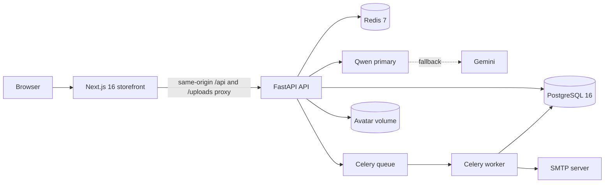

<p align="center">
  
</p>

# Shopy AI

Shopy AI is a goal-driven e-commerce application. Instead of making a shopper
search one product at a time, it accepts a desired outcome—such as “build a
comfortable WFH setup under RM2,000”—and turns it into a catalog-grounded,
audited recommendation or bundle.

The repository contains the complete local system: a Next.js storefront, a
FastAPI commerce API, a LangGraph shopping workflow, PostgreSQL persistence,
Redis short-term memory, and a Celery worker for paid-receipt delivery.

> [!IMPORTANT]
> Shopy is currently a development/demo commerce system. ShopyPay top-ups are
> simulated database credits, and card, FPX, and DuitNow checkout records are
> not connected to external payment gateways. See [Current limitations](#current-limitations).

## Contents

- [What the system does](#what-the-system-does)
- [Architecture](#architecture)
- [How an AI shopping request works](#how-an-ai-shopping-request-works)
- [Application surfaces](#application-surfaces)
- [Data and persistence](#data-and-persistence)
- [API overview](#api-overview)
- [Run the complete stack](#run-the-complete-stack)
- [Seed the catalog](#seed-the-catalog)
- [Run services separately](#run-services-separately)
- [Configuration](#configuration)
- [Observability](#observability)
- [Testing](#testing)
- [Current limitations](#current-limitations)

## What the system does

### Goal-driven shopping

- Accepts text missions, microphone recordings, camera captures, and uploaded
  photos.
- Interprets the goal, budget, required product roles, preferences,
  constraints, priorities, and already-owned items.
- Supports one-product recommendations, comparisons, and complementary bundles.
- Handles follow-ups such as “make it cheaper” by using bounded session memory
  instead of asking the shopper to repeat the entire mission.
- Shows catalog-backed product cards that can be added individually or as a
  complete bundle.

### Multimodal AI

- Text chat and the mission workspace use the same audited shopping
  orchestrator.
- Voice recordings are transcribed by Qwen ASR, with Gemini as a configured
  fallback, before the transcript enters the text workflow.
- Vision supports three modes: `shop_room`, `complete_look`, and `shop_object`.
- Room and outfit results preserve structured vision context and hand the
  already-audited recommendation into the mission workspace.
- Raw audio and submitted shopping photos are not persisted by the application.

### Storefront and account features

- Searchable PostgreSQL-backed product catalog with categories, sellers,
  inventory, prices, specifications, attributes, images, ratings, and reviews.
- Account registration, login, logout, profile editing, and persistent avatar
  uploads.
- HttpOnly cookie sessions and separate anonymous conversation sessions.
- Authenticated carts with quantity and stock validation.
- Checkout, immutable order-item snapshots, order history, and a six-month
  purchase dashboard.
- Verified-purchase product reviews.

### ShopyPay and receipts

- Per-user MYR wallet with an auditable transaction ledger.
- Server-authoritative minimum, daily, and monthly top-up limits.
- Atomic wallet debits and order payment updates during ShopyPay checkout.
- Browser-generated checkout invoice PDF.
- Optional background generation and SMTP delivery of a paid-receipt PDF after
  a successful wallet payment.

### Personalised reminders

- Authenticated shoppers can receive an optional “We think you may also like”
  panel after a catalog-backed recommendation.
- Candidate discovery uses the active mission’s model-generated roles, current
  catalog facts, and 30-minute session memory.
- Products already viewed, selected, rejected, or previously notified are
  excluded.
- An LLM chooses relevant products, but the server accepts only eligible,
  in-stock catalog IDs and records the reminder lifecycle in the same
  orchestration log as normal shopping runs.

## Architecture



| Component | Responsibility |
| --- | --- |
| Next.js | Storefront routes, mission workspace, chat widget, camera and microphone capture, cart UX, checkout, ShopyPay, profile, and dashboard |
| FastAPI | HTTP contracts, authentication, catalog, commerce, conversations, transcription, vision, recommendations, and orchestration history |
| LangGraph | Stateful AI workflow and deterministic routing between mission interpretation, catalog tools, selection, compatibility, writing, and audit |
| PostgreSQL | Durable users, sessions, catalog, carts, orders, payments, wallets, reviews, conversations, and orchestration logs |
| Redis | Sliding-TTL shopping memory and Celery message broker |
| Celery worker | Generates and sends paid-order receipt PDFs without holding the checkout request open |
| Qwen | Primary text reasoning, response generation, image analysis, and dedicated speech-to-text |
| Gemini | Fallback for text, vision, and transcription when configured |

Docker Compose exposes the Next.js application on port `8002` by default. The
database, Redis, API, and worker remain on the private Compose network. Next.js
proxies browser requests to the API so cookies, API traffic, and uploaded
avatars use one browser origin.

## How an AI shopping request works

```text
Customer input
  -> load expiring session memory
  -> analyze image when present
  -> interpret mission and continuation intent
  -> derive required and optional product roles
  -> optionally expand a broad request into a practical plan
  -> build a deterministic execution plan
  -> retrieve a bounded, role-balanced catalog shortlist
  -> ask the LLM to select only from verified candidate IDs
  -> check selected-product compatibility when relevant
  -> build a catalog-grounded response draft
  -> deterministic audit
  -> optional brand-voice polish
  -> final deterministic audit
  -> save bounded memory
  -> persist the conversation and return product attachments
```

### Workflow stages

| Stage | What it contributes |
| --- | --- |
| `memory_load` | Loads a small Redis context for the authenticated session or anonymous conversation; a new image starts a fresh mission |
| `vision` | Extracts observable items, style, colors, constraints, and possible shopping needs from an image |
| `intent_agent` | Produces a typed mission contract and decides whether a text request continues the prior mission |
| `need_planner` | Converts runtime intent into required and optional product roles without a hard-coded catalog taxonomy |
| `planning` | Expands broad planning requests and derives catalog queries when actual products are required |
| `manager` | Deterministically enables only known stages and read-only actions |
| `product_search` | Searches product names, categories, brands, descriptions, specs, and attributes with bounded role-specific queries |
| `product_selector` | Uses the configured LLM to choose from the verified shortlist; server validation rejects invalid IDs, duplicates, role gaps, hard-constraint failures, incompatible combinations, and invalid budgets |
| `compatibility` | Uses an LLM only to propose relevant comparisons, then evaluates verified fields deterministically; owned items without catalog specs are marked for confirmation |
| `response_draft` | Produces customer-facing text, attachments, structured claims, bundle coverage, and disclosed gaps |
| `audit` | Re-fetches current facts and verifies IDs, stock, prices, arithmetic, budget rules, fulfillment, response claims, and attachments without an LLM call |
| `brand_voice` | Optionally improves wording when the request is still within the soft deadline |
| `final_audit` | Re-validates polished text and restores the previously audited draft if polishing introduced an unsupported claim |
| `memory_update` | Stores only bounded mission context after an accepted response |

### Grounding and safety boundaries

The LLM performs semantic work: understanding the request, generating search
vocabulary, selecting relevant products, and writing the response. It is not
the authority for inventory, product identity, price, totals, or fulfillment.

The server keeps those boundaries deterministic:

- The model sees a bounded shortlist, never the complete catalog.
- Agent tools are request-scoped and read-only; they expose no SQL, user
  identity, or mutation capability.
- Product selections contain only a product ID and quantity.
- Current catalog facts are re-read during both audits; stock checks are never
  served from the request cache.
- A recommendation is rejected rather than silently replaced with a
  deterministic product choice.
- Missing roles and catalog gaps must be visible in both structured state and
  customer-facing text.
- Review text, memory, image observations, and catalog prose are treated as
  untrusted data rather than instructions.
- Hidden chain-of-thought is neither returned nor stored.

### Short-term shopping memory

Redis stores a JSON document with a sliding inactivity TTL (30 minutes by
default). It includes a compact summary, recent turns, the current mission,
budget, preferences, constraints, owned items, viewed/selected/rejected/notified
product IDs, current bundle, and optimization mode.

Memory is scoped to an authenticated user plus auth session, or to an anonymous
conversation. Redis keys contain a SHA-256 digest rather than a raw session
secret. Logout revokes the database session and attempts to clear its shopping
memory. If Redis is unavailable, the request continues without memory.

## Application surfaces

| Route | Purpose | Access |
| --- | --- | --- |
| `/` | Goal-first homepage, mission shortcuts, voice input, and camera entry point | Public |
| `/build` | Active mission workspace, progress display, audited results, refinements, bundle editing, and add-to-cart actions | Public; cart changes require login |
| `/shop` | Searchable server-rendered catalog | Public |
| `/product/[id]` | Product details and add-to-cart action | Public; cart changes require login |
| `/login`, `/signup` | Account authentication | Public |
| `/cart` | Cart quantities, removal, subtotal, and checkout handoff | Authenticated |
| `/checkout` | ShopyPay balance check, delivery summary, invoice export, and wallet checkout | Authenticated |
| `/shopy-pay` | Wallet balance, limits, top-up controls, and transaction history | Authenticated |
| `/profile` | Avatar, account shortcuts, logout, and order history | Authenticated |
| `/dashboard` | Six-month order frequency and total-spend summary | Authenticated |
| `/settings` | Full name and phone updates | Authenticated |
| `/legal/[document]` | Privacy, terms, and cookie-policy content | Public |

The floating assistant is mounted globally. It supports text, recorded voice,
camera input, word-preserving NDJSON replies, and linked product attachments.
The API finishes and audits the answer before it releases response words to the
client; this prevents partially generated, unaudited product claims from being
shown.

## Data and persistence

PostgreSQL is the durable source of truth. The main model groups are:

- Identity: users, auth sessions, addresses, and avatar URLs.
- Catalog: sellers, categories, products, product images, and reviews.
- Commerce: carts, cart items, orders, immutable order-item snapshots, and
  payment records.
- Wallet: one wallet per user and an append-style transaction ledger linked to
  purchases when applicable.
- AI: shopping missions, conversations, messages, recommendations,
  orchestration runs, and ordered orchestration events.

Named Docker volumes preserve PostgreSQL, Redis AOF data, and uploaded avatars:

```text
shopy_postgres_data   PostgreSQL cluster
shopy_redis_data      Redis append-only data
shopy_uploads         Backend-managed avatar files
```

Database migrations run automatically when the backend container starts.
Migrations do not seed or overwrite catalog data.

## API overview

When running the backend directly, OpenAPI is available at
[http://localhost:8000/docs](http://localhost:8000/docs). The default Compose
stack does not publish port `8000`; browser-facing API calls instead use
`http://localhost:8002/api/...` through the Next.js proxy.

| Area | Method and path | Access |
| --- | --- | --- |
| Health | `GET /health`, `GET /health/database` | Public, backend origin |
| Auth | `POST /api/v1/auth/register`, `POST /login`, `POST /logout` | Public/session |
| Profile | `GET /api/v1/auth/me`, `PATCH /me`, `POST /avatar` | Authenticated |
| Catalog | `GET /api/v1/products`, `/products/{id}`, `/products/slug/{slug}`, `/categories`, `/sellers` | Public |
| Reviews | `GET /api/v1/products/{id}/reviews` | Public |
| Review creation | `POST /api/v1/products/{id}/reviews` | Authenticated verified purchaser |
| Cart | `GET /api/v1/cart`, `POST /cart/items`, `PATCH` or `DELETE /cart/items/{id}` | Authenticated |
| Orders | `POST /api/v1/orders/checkout`, `GET /orders`, `GET /orders/{id}` | Authenticated |
| Wallet | `GET /api/v1/wallet`, `POST /wallet/top-ups` | Authenticated |
| Chat | `POST /api/chat`, `POST /api/chat/stream` | Guest or authenticated |
| Voice | `POST /api/v1/transcribe` | Public |
| Vision | `POST /api/v1/shopping/missions/vision` | Guest or authenticated |
| Reminder | `POST /api/v1/recommendations/reminder` | Authenticated |
| Run history | `POST`, `GET /api/v1/agentic/runs`; `GET /runs/{id}` | Authenticated owner |

### Chat request

```bash
curl -X POST http://localhost:8002/api/chat \
  -H 'Content-Type: application/json' \
  -c /tmp/shopy-cookies.txt \
  -b /tmp/shopy-cookies.txt \
  -d '{"messages":[{"role":"user","content":"Build me a wireless gaming setup under RM4,000"}]}'
```

`POST /api/chat/stream` returns newline-delimited JSON events:

```text
start -> progress heartbeats -> delta events -> done
                                  or error
```

The `done` event contains the conversation ID, catalog attachments, mission
contract, and workspace data.

### Voice request

The transcription endpoint accepts WebM, WAV, MP3, M4A/MP4, and OGG files up to
14 MB.

```bash
curl -X POST http://localhost:8002/api/v1/transcribe \
  -F 'audio=@/absolute/path/to/recording.webm;type=audio/webm' \
  -F 'language=en'
```

### Vision request

The vision endpoint accepts JPEG, PNG, and WebP images up to 10 MB.

```bash
curl -X POST http://localhost:8002/api/v1/shopping/missions/vision \
  -F 'image=@/absolute/path/to/room.jpg;type=image/jpeg' \
  -F 'mode=shop_room'
```

Valid modes are `shop_room`, `complete_look`, and `shop_object`. An optional
`style` form field can refine a complete-look request.

## Run the complete stack

### Prerequisites

- Docker Desktop with Docker Compose
- A Qwen API key, a Gemini API key, or both for AI features
- At least one seeded catalog collection for useful product results

### 1. Create local configuration

From the repository root:

```bash
cp .env.example .env
```

Replace the example PostgreSQL password and add provider credentials. Qwen is
the primary provider when `QWEN_API_KEY` is set; Gemini is used when Qwen is not
configured or a Qwen generation fails.

Never expose provider keys through a `NEXT_PUBLIC_` variable or commit `.env`.

### 2. Start the application

```bash
docker compose up -d --build
```

### 3. Check container health

```bash
docker compose ps
```

### 4. Seed products on a fresh database

Follow [Seed the catalog](#seed-the-catalog). Existing named volumes retain
previously seeded data.

### 5. Open Shopy

[http://localhost:8002](http://localhost:8002)

Useful lifecycle commands:

```bash
docker compose logs -f backend worker
docker compose stop
docker compose down
```

`docker compose down` keeps named volumes. Adding `--volumes` deletes local
database, Redis, and upload data and cannot be undone.

## Seed the catalog

Catalog seeders are idempotent: they update stable SKU records instead of
duplicating them. After the stack is running, execute any or all of these
self-contained collections from the repository root:

```bash
docker compose exec backend poetry run python -m app.scripts.seed_apparel_catalog
docker compose exec backend poetry run python -m app.scripts.seed_beauty_catalog
docker compose exec backend poetry run python -m app.scripts.seed_car_care_catalog
docker compose exec backend poetry run python -m app.scripts.seed_device_catalog
docker compose exec backend poetry run python -m app.scripts.seed_furniture_catalog
docker compose exec backend poetry run python -m app.scripts.seed_travel_catalog
docker compose exec backend poetry run python -m app.scripts.seed_working_kit_catalog
```

These collections provide structured catalog evidence for clothing, beauty,
car care, devices, furniture, travel, and work/study missions.

The optional legacy catalog importer reads
`frontend/src/features/products/data/products.ts` and therefore must run from a
host checkout with frontend dependencies and Node.js available:

```bash
cd frontend
npm ci

cd ../backend
poetry install
poetry run python -m app.scripts.seed_catalog
```

## Run services separately

Docker Compose is the recommended setup. For backend or frontend development,
start only infrastructure first:

```bash
docker compose up -d postgres redis
```

Run the API from `backend/`:

```bash
cd backend
poetry install
poetry run alembic upgrade head
poetry run uvicorn app.main:app --reload --port 8000
```

In another terminal, run Next.js from `frontend/` and point its server-side
proxy at the host API:

```bash
cd frontend
npm ci
BACKEND_ORIGIN=http://localhost:8000 npm run dev
```

Open [http://localhost:3000](http://localhost:3000). Because the browser still
uses same-origin `/api` requests, provider credentials remain server-side.

## Configuration

All backend settings are loaded from the root `.env`. Compose passes only
browser-safe values into the frontend build.

| Variable | Purpose | Template default |
| --- | --- | --- |
| `APP_PORT` | Published Next.js port | `8002` |
| `BACKEND_ORIGIN` | Backend destination used by the Next.js proxy | `http://backend:8000` |
| `BACKEND_PROXY_TIMEOUT_MS` | Long AI request proxy timeout | `120000` |
| `FRONTEND_ORIGIN`, `DOCKER_FRONTEND_ORIGIN` | Allowed browser origin for direct API requests | `http://localhost:8002` |
| `QWEN_API_KEY` | Alibaba Cloud Model Studio credential | empty/example |
| `QWEN_BASE_URL` | Qwen OpenAI-compatible API root | DashScope international endpoint |
| `QWEN_MODEL` | Primary text model | `qwen3.7-max-2026-06-08` |
| `QWEN_VISION_MODEL` | Image-capable model | `qwen3.5-omni-plus` |
| `QWEN_AUDIO_MODEL` | Dedicated speech-to-text model | `qwen3-asr-flash-2025-09-08` |
| `GEMINI_API_KEY`, `GEMINI_MODEL` | Fallback provider and model | empty/example, `gemini-3.7-flash` |
| `POSTGRES_*`, `DATABASE_URL` | Host database configuration | PostgreSQL on host port `5433` |
| `REDIS_URL`, `DOCKER_REDIS_URL` | Host and container Redis locations | host `6380`, container `6379` |
| `SHOPPING_MEMORY_TTL_SECONDS` | Sliding memory inactivity expiry | `1800` |
| `SHOPPING_MEMORY_RECENT_TURNS` | Recent message records retained | `8` |
| `UPLOAD_DIRECTORY`, `DOCKER_UPLOAD_DIRECTORY` | Host/container avatar storage path | durable backend data directory / mounted volume |
| `AUTH_SESSION_DAYS`, `AUTH_COOKIE_SECURE` | Session lifetime and HTTPS-only cookie mode | `7`, `false` for local HTTP |
| `WALLET_MINIMUM_TOP_UP` | Server-authoritative minimum wallet credit | `10.00` |
| `SMTP_*` | Optional paid-receipt email delivery | disabled while host/from are empty |
| `AI_LOG_CUSTOMER_INPUT` | Include customer text in local terminal events | `true` |
| `AI_LOG_AGENT_NODE_PAYLOADS` | Include safe node input/output payloads in terminal events | `true` |

Agent candidate sizes, graph limits, tool limits, output limits, deadlines, and
budget tolerance are controlled by the `AGENT_*` variables in `.env.example`.
The API validates those bounds and never treats them as model instructions.

The PostgreSQL password is applied when the named database volume is first
created. Changing `.env` later does not update the password stored inside an
existing cluster.

## Repository layout

```text
.
├── README.md
├── .env.example
├── docker-compose.yml
├── docs/
│   └── shopy-demo-video-script.md
├── backend/
│   ├── app/
│   │   ├── agentic/          LangGraph state, agents, tools, memory, and audit
│   │   ├── ai/               Qwen, Gemini, and primary/fallback clients
│   │   ├── api/routes/       HTTP route handlers
│   │   ├── models/           SQLAlchemy models and enums
│   │   ├── scripts/          Idempotent catalog seeders
│   │   ├── services/         Catalog, cart, order, wallet, and receipt logic
│   │   ├── config.py         Environment-backed settings
│   │   ├── main.py           FastAPI application factory
│   │   └── worker.py         Celery application and receipt task
│   ├── migrations/           Alembic schema history
│   ├── tests/                Backend regression suite
│   ├── pyproject.toml
│   └── README.md             Backend-focused notes
└── frontend/
    ├── src/
    │   ├── app/              Next.js routes and route styles
    │   ├── components/       Shared layout, auth, and UI components
    │   ├── features/         Assistant, missions, vision, products, cart, reminders
    │   └── lib/              API, auth, checkout, and event helpers
    ├── next.config.ts        API/upload proxy and browser media policy
    └── package.json
```

## Observability

Every text, voice, camera, normal shopping, and behavioral-reminder request has
a short request ID and structured terminal events. Safe graph-node payloads are
enabled by default for local development.

PostgreSQL tables `orchestration_runs` and `orchestration_run_events` record:

- run type, status, duration, and final response;
- ordered node transitions and tool calls;
- candidate, excluded, and selected product IDs;
- selection reasons, compatibility results, and audit results;
- provider-reported input, output, and total token counts; and
- safe error summaries.

They do not store provider credentials, raw audio, raw image bytes, auth
cookies, or hidden reasoning. Set `AI_LOG_CUSTOMER_INPUT=false` to replace
customer text with a character count in logs.

Example query:

```sql
SELECT r.request_id,
       r.run_type,
       r.status,
       r.total_tokens,
       e.sequence,
       e.event_type,
       e.node_name,
       e.tool_name,
       e.duration_ms,
       e.input_data,
       e.output_data,
       e.error_message
FROM orchestration_runs AS r
JOIN orchestration_run_events AS e ON e.run_id = r.id
ORDER BY r.created_at DESC, e.sequence;
```

Authenticated owners can also inspect their normal shopping runs through
`GET /api/v1/agentic/runs` and `GET /api/v1/agentic/runs/{run_id}`.

## Testing

Backend:

```bash
cd backend
poetry run pytest
poetry check
```

If the repository-local virtual environment already exists, run its test
binary from `backend/` so Alembic resolves `alembic.ini` correctly:

```bash
cd backend
.venv/bin/pytest -q
```

Frontend:

```bash
cd frontend
npm run lint
npm run build
```

Infrastructure and migrations:

```bash
docker compose config
docker compose ps
docker compose exec backend poetry run alembic current
```

## Current limitations

- ShopyPay top-ups immediately credit the development wallet; there is no
  external funding-source authorization or settlement.
- The web checkout currently submits a sample Malaysian recipient and delivery
  address. A production checkout needs editable, validated address selection.
- Card, FPX, and DuitNow exist in the backend payment enum, but only ShopyPay is
  completed by the current web checkout. Other methods create pending payment
  records and need gateway callbacks before they can be called paid.
- The wallet UI mentions controls such as two-factor approval, spending alerts,
  and refund routing, but those controls are presentation content rather than
  implemented API workflows.
- The checkout shipping fee is a browser-session demo quote between RM3 and
  RM30. A production system needs a carrier or rate service and server-owned
  quotation rules.
- Product images and seed data are demonstration catalog content.
- Receipt email is disabled until SMTP is configured. Failed delivery is logged
  and does not roll back an already committed purchase.
- AI features require at least one configured provider and can still fail on
  provider timeout, unavailable catalog coverage, or audit rejection.
- The application has not implemented production payment compliance, fraud
  controls, refunds, tax jurisdiction logic, carrier fulfillment, or an admin
  console.

## Troubleshooting

### Containers are running but the catalog is empty

Migrations create the schema but intentionally do not insert catalog data. Run
one or more commands from [Seed the catalog](#seed-the-catalog).

### `ModuleNotFoundError` when running backend commands

```bash
cd backend
poetry install
poetry run uvicorn app.main:app --reload --port 8000
```

### Database authentication fails after editing `.env`

The existing `shopy_postgres_data` volume still contains the password from its
first initialization. Update the PostgreSQL role deliberately, or recreate only
the development volume if its data is disposable.

### Redis memory is unavailable

```bash
docker compose ps redis
docker compose logs redis
```

Shopping requests should continue without prior-session context, while Celery
receipt jobs remain unavailable until Redis recovers.

### Camera or microphone access is blocked

Browser media capture requires HTTPS or localhost. Use
`http://localhost:8002` on the same computer, grant browser permissions, or use
the gallery/file-picker fallback for image shopping.

### Browser requests fail through the proxy

Check that `BACKEND_ORIGIN` points to `http://backend:8000` in Compose or
`http://localhost:8000` during separate local development. Then restart the
frontend so its proxy configuration is rebuilt.

## Before publishing

- Keep `.env`, credentials, local uploads, virtual environments, and build
  output out of Git.
- Run the backend and frontend checks above.
- Review `git status` and commit only intended files.
- Replace demo catalog/payment assumptions as needed.
- Add a project license before public distribution.
